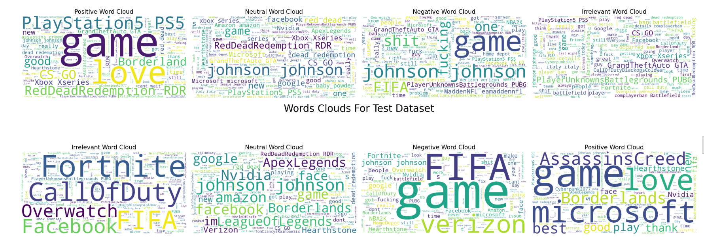
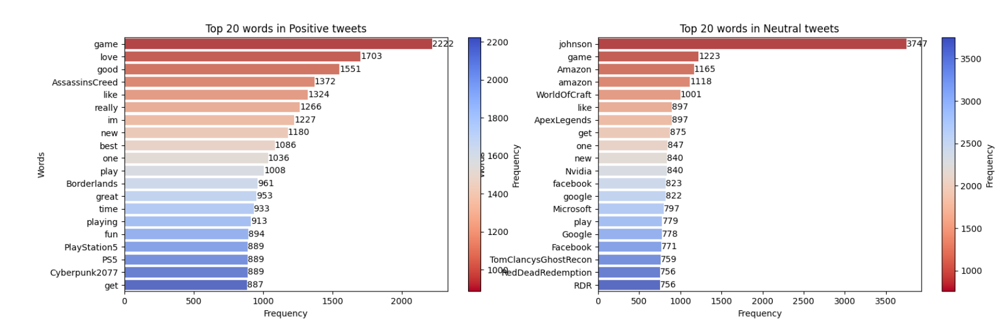

# sentiment-analysis
sentiment analysis on tweeter 74k tweets
dataset URL -- 
<h2>Tasks</h2>
<ol>
  <li>drop NaN values</li>
  <li>drop Duplicates</li>
  <li>solve fast typings</li>
  <li>handle emoji</li>
  <li>remove links and mentions</li>
  <li>remove punctuation and special charecters</li>
  <li>lowercasing</li>
  <li>remove stop word</li>
  <li>need corefference</li>
  <li>Tokenization</li> 
</ol>

 

<h2>Task that planned but not done</h2>
<ul>
  <li>solve spelling errors: <strong>due to time required</strong></li>
  <li>synomyme remove: <strong>due to time required</strong></li>
  <li>try name-entity-recognition</li>
  <li>detect language</li>
  <li>stemming</li>
</ul>

<h2>Visualization</h2>
  <ul style="list-style-type:none">
    <li>wordcloud</li>
    <li></li>
  </ul>
  <ul style="list-style-type:none">
    <li> word frequencies</li>
    <li></li>
    <li></li>
    <li></li>
    <li></li>
  </ul>
  <ul style="list-style-type:none">
    <li>NN model summary</li>
    <li></li>
    <li>Confusion Matrix</li>
    <li></li>
    <li>Loss graph</li>
    <li></li>
  </ul>

  
<h2>Thank You</h2>

